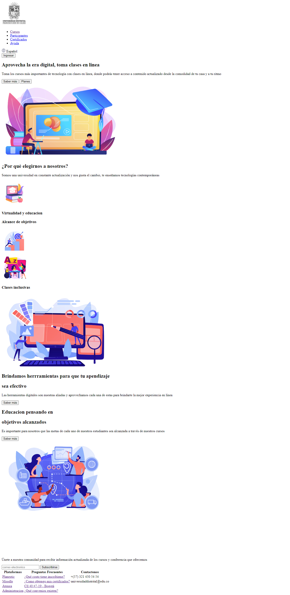
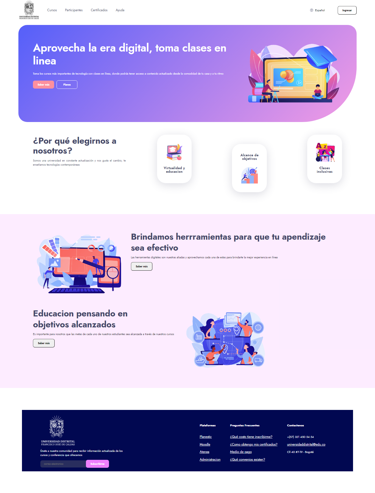

<h1>Taller 9 Fabian Jose Cabiativa Musuzu</h1>

<h2> Información</h2>

Curso: full Stack Basico - Grupo 1

Profesor: Cristian Patiño

<h3> Link Página Web</h3>
<a href="https://thegriuch.github.io/Taller-9-full-stack2/" target="blank"> Link Página Web</a>

<h2> Punto 1: Link figma</h2>

<a href="https://www.figma.com/file/WHq381hbgLi9mZNDfWlto9/Untitled?type=design&node-id=1%3A249&mode=design&t=v0NbvJP0WZDXsSiO-1" target="_blank">Link de Figma</a>

<h2>Punto 2: HTML</H2>

<h2>Punto 3: CSS</H2>

